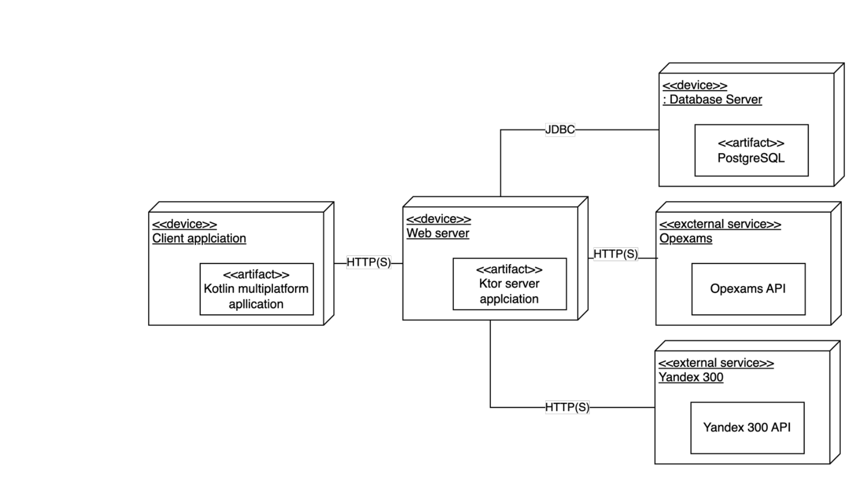
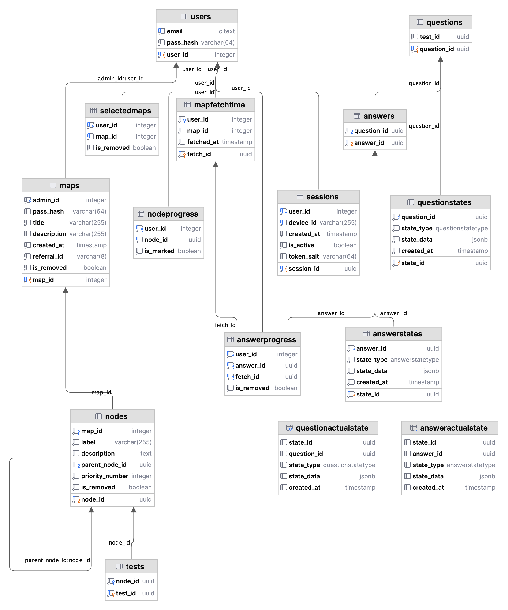

# MIND IN SYNC - KTOR Backend Server


-----

## Table of Contents

- [Introduction](#introduction)
- [Architecture](#architecture)
- [Features](#features)
- [Installation](#installation)
- [Database Schema](#database-schema)
- [Usage](#usage)
- [API Endpoints](#api-endpoints)

## Introduction

This application serves as the backend for the MIND IN SYNC application, handling data storage, retrieval, and business
logic using KTOR, a Kotlin-based framework.

## Architecture

The server application follows a modular architecture to separate different concerns, ensuring better maintainability
and scalability.

### Deployment Architecture Diagram



## Features

- **User Authentication**: Secure login and session management.
- **Diagram Management**: Create, edit, and view connection diagrams.
- **Automated AI Test Generation**: Generate tests based on the provided educational content.
- **Progress Tracking**: Track the learning progress of users.
- **Admin Tools**: Manage content and monitor user performance.

## Installation

### Prerequisites

- [Kotlin 1.8+](https://kotlinlang.org/)
- [PostgreSQL](https://www.postgresql.org/)

### Steps

1. **Clone the repository:**
   ```sh
   git clone https://github.com/MILKA-TOP/BACKEND-MINDMAP
   cd BACKEND-MINDMAP
   ```

2. **Setup the database using Docker:**
   ```sh
   docker-compose up -d
   ```

3. **Run the application:**
   ```sh
   ./gradlew run
   ```

## Database Schema

The application uses PostgreSQL for data storage. Below is the schema for the database.



## Usage

### Running the Server

To run the server locally:

```sh
./gradlew run
```


## API Endpoints

### User Endpoints

- **Register User**
   - **URL**: `/user/registry`
   - **Method**: `POST`
   - **Description**: Registers a new user.
   - **Request Body**: `RegistryReceiveRemote`

- **Login User**
   - **URL**: `/user/enter-auth-data`
   - **Method**: `POST`
   - **Description**: Logs in a user.
   - **Request Body**: `EnterDataReceiveRemote`

- **Create Token**
   - **URL**: `/user/create-token`
   - **Method**: `POST`
   - **Description**: Generates a new token for the user.
   - **Authenticated**: Yes

- **Revoke Device**
   - **URL**: `/user/revoke-device{userId}`
   - **Method**: `POST`
   - **Description**: Revokes the device for the given user.
   - **Authenticated**: No

### Catalog Endpoints

- **Get Catalog**
   - **URL**: `/catalog`
   - **Method**: `GET`
   - **Description**: Retrieves the list of added diagrams.
   - **Authenticated**: Yes

- **Search Catalog**
   - **URL**: `/catalog/search{query}`
   - **Method**: `GET`
   - **Description**: Searches diagrams by query.
   - **Authenticated**: Yes

### Maps Endpoints

- **Create Map**
   - **URL**: `/maps/create`
   - **Method**: `POST`
   - **Description**: Creates a new map.
   - **Authenticated**: Yes

- **Migrate Map**
   - **URL**: `/maps/migrate`
   - **Method**: `POST`
   - **Description**: Migrates an existing map.
   - **Authenticated**: Yes

- **Add Map**
   - **URL**: `/maps/add-map`
   - **Method**: `POST`
   - **Description**: Adds a new map.
   - **Authenticated**: Yes

- **Fetch Map**
   - **URL**: `/maps/fetch{mapId}`
   - **Method**: `GET`
   - **Description**: Fetches the details of a map.
   - **Authenticated**: Yes

- **View Map**
   - **URL**: `/maps/view{mapId}{userId}`
   - **Method**: `GET`
   - **Description**: Views a map as a specific user.
   - **Authenticated**: Yes

- **Update Map**
   - **URL**: `/maps/update{mapId}`
   - **Method**: `POST`
   - **Description**: Updates a map.
   - **Authenticated**: Yes

- **Erase Map**
   - **URL**: `/maps/erase{mapId}{type}`
   - **Method**: `POST`
   - **Description**: Erases a map.
   - **Authenticated**: Yes

- **Delete Map**
   - **URL**: `/maps/delete{mapId}`
   - **Method**: `POST`
   - **Description**: Deletes a map.
   - **Authenticated**: Yes

### Nodes Endpoints

- **Toggle Node Selection**
   - **URL**: `/nodes/toggle-selection{nodeId}`
   - **Method**: `POST`
   - **Description**: Toggles the selection of a node.
   - **Authenticated**: Yes

### Testing Endpoints

- **Submit Test**
   - **URL**: `/tests/submit-test{testId}`
   - **Method**: `POST`
   - **Description**: Submits the test results for a node.
   - **Authenticated**: Yes

- **Generate Test**
   - **URL**: `/tests/generate{nodeId}`
   - **Method**: `POST`
   - **Description**: Generates a test for a node.
   - **Authenticated**: Yes
